Summary

     A cross-platform mobile application that acts as a bridge between customers and beauty establishments (Spas, Salons, Nails), while providing a comprehensive digital solution to help business owners optimize their management and appointment scheduling processes.****

### User Interfaces

|                             Screen                              |                          Screen                           |                                Screen                                 |                               Screen                               |                               Screen                               |
|:---------------------------------------------------------------:|:---------------------------------------------------------:|:---------------------------------------------------------------------:|:------------------------------------------------------------------:|:------------------------------------------------------------------:|
|        |  | 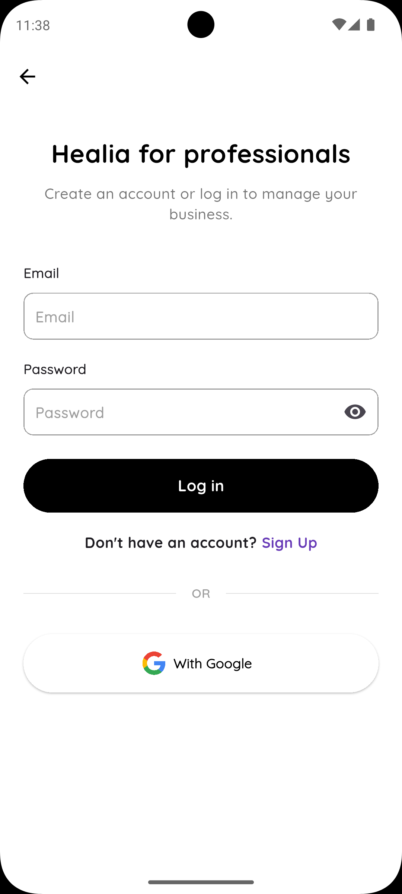 | 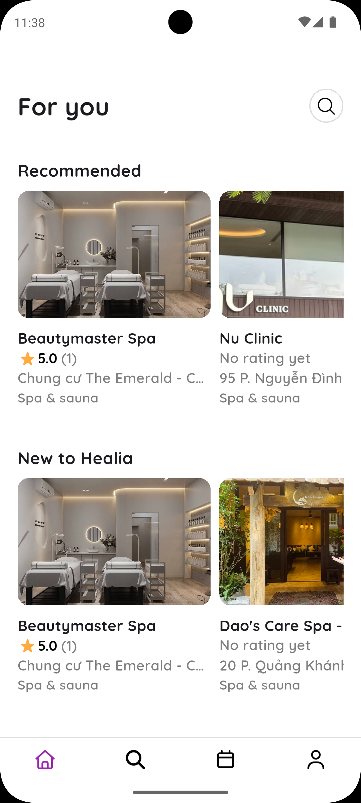 |  |
|   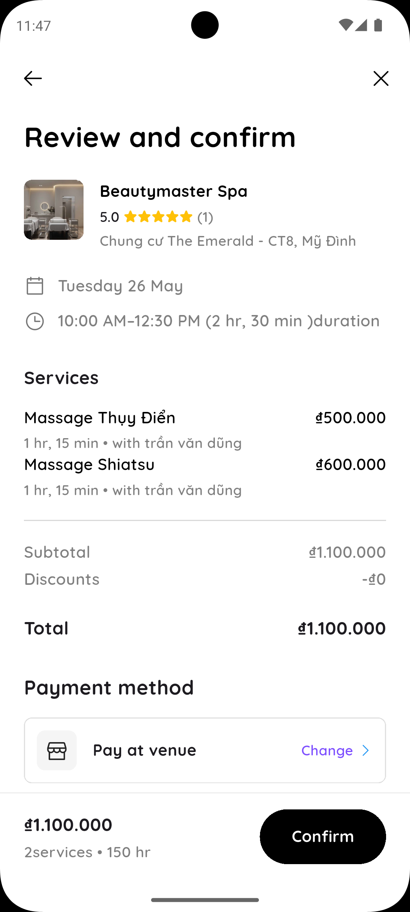   | 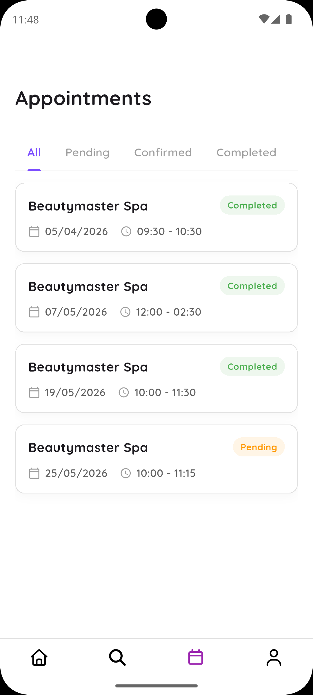 |       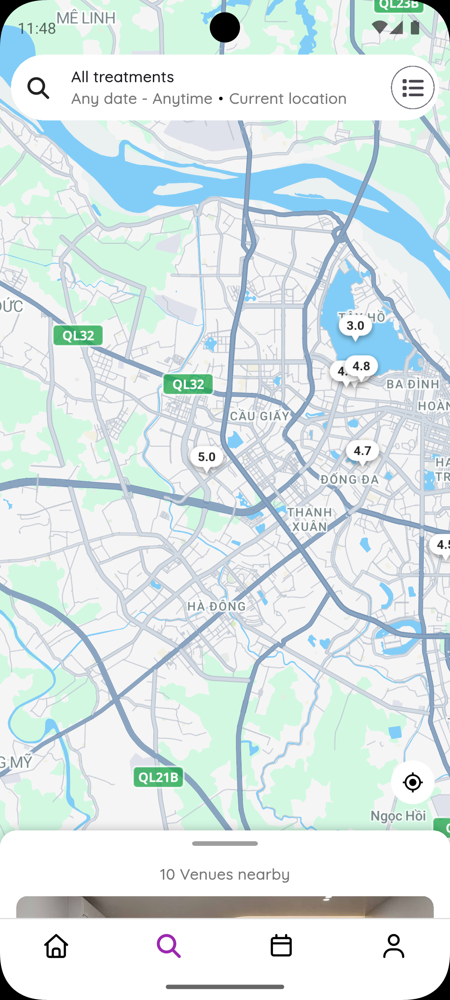       |     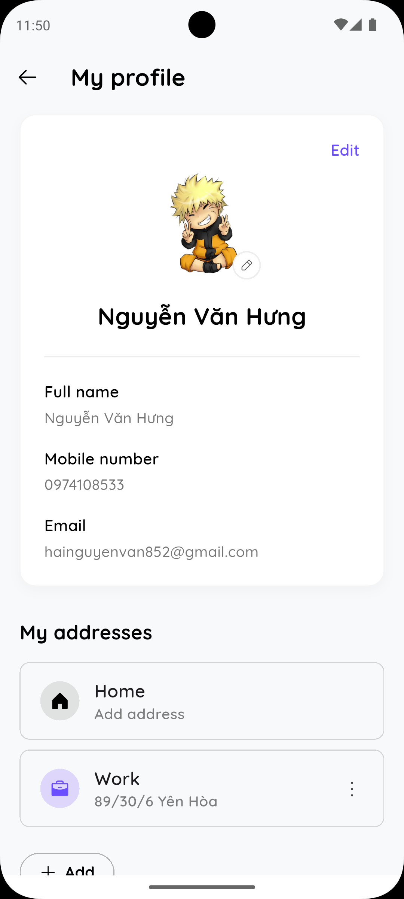      |      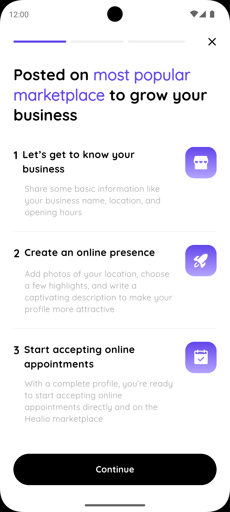      |
|       | 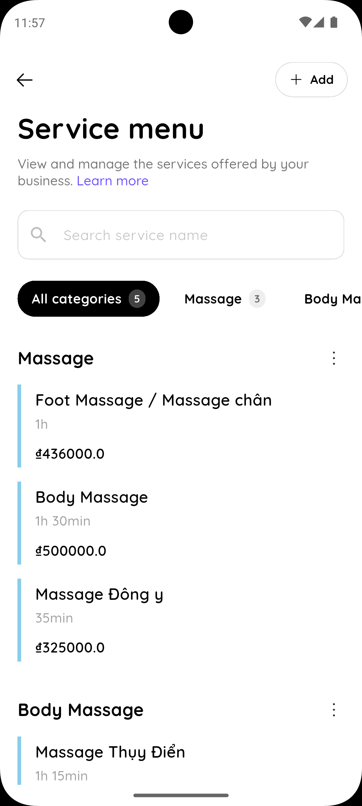 |    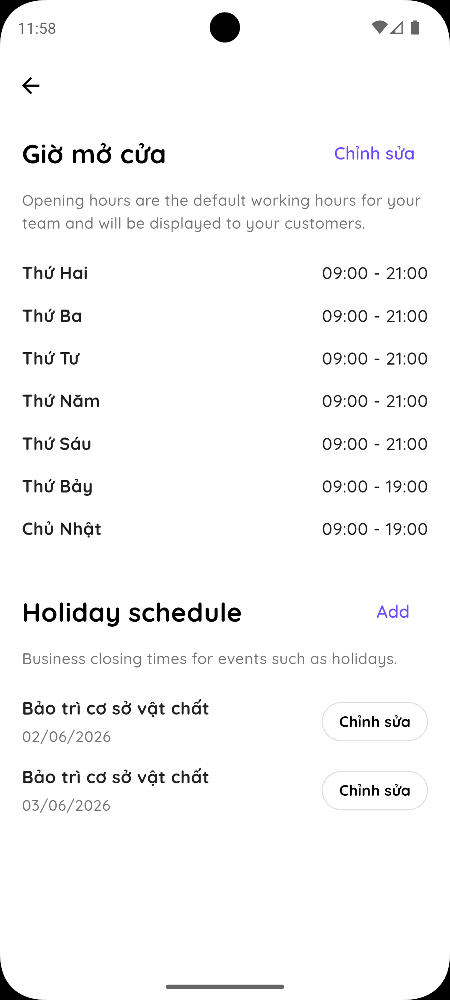     |  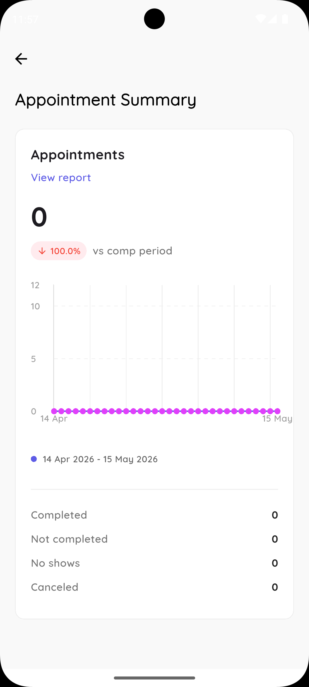   |    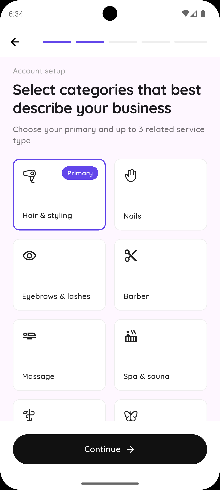     |

Technologies

    Framework: Flutter (Dart)
    
    Backend: Supabase - Use services like Database, Authentication, Edge Fuctions and Storage.
    
    State Management: Cubit/BLoC
    
    Database: Supabase(PostgreSQL) - Store and manage data efficiently.
    
    Authentication: Supabase Authentication - Manage registration and login securely for users include: Email, Google.

